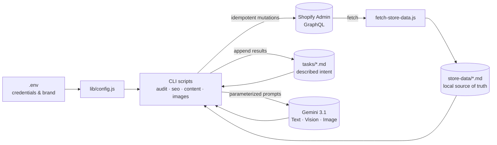

# shopify-automation-toolkit

[](https://nodejs.org)
[](LICENSE)
[](https://shopify.dev/docs/api/admin-graphql)
[](https://ai.google.dev/)
[](package.json)

Reusable Node.js toolkit to automate audits, SEO, content and image
workflows for a Shopify store, **driven by Markdown task files** and
powered by **Gemini 3.1** (text / vision / image).

> No npm dependencies. Only Node.js ≥ 18 and the Shopify CLI.

## Why this toolkit

| Need | Answer |
|---|---|
| Audit a store end-to-end | `audit/full-audit.js` → SEO/UX/Content/Operations score |
| Generate the missing SEO meta tags | `seo/seo-update.js` |
| Rewrite descriptions that are too short via AI | `content/update-products.js` + Gemini Text |
| Regenerate a product image | `images/image-generate.js` + Gemini Image |
| Audit image quality | `images/visual-audit.js` + Gemini Vision |
| Migrate email templates Klaviyo → Shopify Email | `integrations/shopify-email/adapt-templates.js` |

## Architecture at a glance



**3 pillars**:

1. **`store-data/`** — single extraction of the store into 9 Markdown
   files (local source of truth, diffable, human-readable).
2. **`lib/` + CLI scripts** — 14 reusable modules (one file = one
   responsibility) + per-domain commands (`audit/`, `seo/`, `content/`,
   `images/`).
3. **`tasks/`** — Markdown files describing intent (Target + Action +
   Validation), executed by generic scripts that append their results.

## Install (5 minutes)

```bash
# 1. Clone
git clone https://github.com/djebar-rayan/shopify-automation-toolkit.git
cd shopify-automation-toolkit

# 2. Configure
cp .env.example .env
# … then edit .env (SHOPIFY_STORE, GEMINI_API_KEY, …)

# 3. Authenticate with the Shopify CLI
shopify store auth --store <your-store>.myshopify.com \
  --scopes read_products,write_products,read_content,write_content,read_themes,write_files

# 4. Extract the current state
node fetch-store-data.js
```

## Usage in 30 seconds

```bash
# Read-only: full audit → audit-report.md
node audit/full-audit.js

# Targeted audit driven by a task file
node audit/audit.js --task tasks/example-audit-images.md

# SEO: generate the missing meta titles (local formulas, free)
node seo/seo-update.js --target=titles --confirm

# Content: enrich short descriptions (Gemini Text)
cp tasks/_template.md tasks/enrich-desc.md
# … fill it in, then:
node content/update-products.js --task tasks/enrich-desc.md

# Images: audit + multi-variant regeneration
node images/image-audit.js
node images/image-generate.js --mode=multi-variant --handle=my-product
node images/image-upload.js --handle=my-product --dir=generated-images --confirm
```

## Architecture

```
shopify-automation-toolkit/
├── lib/                  # Common layer (reusable modules, one file = one responsibility)
│   ├── config.js                # reads .env, exposes all constants
│   ├── shopify-graphql.js       # execGql / execMutation
│   ├── task-file.js             # task-file parser
│   ├── store-data.js            # parser for store-data/<scope>.md
│   ├── filter-dsl.js            # mini filter DSL
│   ├── cli.js                   # getFlag / confirm / sleep
│   ├── text.js                  # stripHtml / wordCount
│   ├── gemini-text.js           # Gemini Text (descriptions, prompts)
│   ├── gemini-vision.js         # Gemini Vision (image analysis)
│   ├── gemini-image.js          # Gemini Image (generation)
│   ├── image-download.js        # HTTP → base64 download
│   ├── image-validate.js        # size/resolution validation
│   ├── image-upload.js          # staged upload + multipart + productCreateMedia
│   └── builders/                # parameterized generators
│       ├── seo-meta.js              # meta titles/descriptions/alt
│       ├── content-prompts.js       # parameterized Gemini prompts
│       ├── handle.js                # Unicode→ASCII handle normalization
│       ├── shipping.js              # HTML shipping block
│       └── translit-presets/        # JSON maps for non-Latin scripts
│
├── fetch-store-data.js   # Single extraction → store-data/*.md (re-run after changes)
│
├── audit/                # READ ONLY
│   ├── audit.js                 # generic task-driven audit
│   ├── full-audit.js            # full audit with scoring
│   └── examples/                # ready-to-use audit tasks
│
├── seo/                  # SEO META UPDATES
│   ├── seo-update.js            # titles / descriptions / alt
│   └── examples/
│
├── content/              # PRODUCT / COLLECTION / PAGE UPDATES
│   ├── update-products.js
│   ├── update-collections.js
│   ├── update-pages.js
│   ├── handle-normalize.js      # dedicated CLI for non-ASCII handles
│   └── examples/
│
├── images/               # IMAGE WORKFLOW
│   ├── image-audit.js           # counts + missing alt
│   ├── image-alt.js             # alt texts (formulas or Vision)
│   ├── image-generate.js        # Gemini Image generation (single / multi-variant)
│   ├── image-upload.js          # staged upload + variant binding
│   ├── visual-audit.js          # image quality via Gemini Vision
│   └── examples/
│
├── integrations/         # THIRD-PARTY CONNECTORS
│   ├── klaviyo/                 # read-only Klaviyo export
│   └── shopify-email/           # HTML adaptation for Shopify Email
│
├── tasks/                # TASK FILES
│   ├── _template.md             # commented template
│   └── example-*.md             # examples
│
├── store-data/           # AUTO-GENERATED by fetch-store-data.js (gitignored)
├── generated-images/     # AUTO-GENERATED by images/image-generate.js (gitignored)
│
├── docs/                 # Detailed documentation
│   ├── QUICK_START.md
│   ├── COMMAND_REFERENCE.md
│   ├── TASK_FORMAT.md
│   ├── GEMINI_SETUP.md
│   ├── SHOPIFY_AUTH.md
│   ├── TROUBLESHOOTING.md
│   └── SKILLS.md
│
├── .claude/skills/       # Claude Code skills (optional, GitHub-shareable)
├── .env.example          # Config template
├── CLAUDE.md             # Critical technical rules
├── ARCHITECTURE.md       # store-data/scripts/tasks triad vision
└── package.json
```

## Usage model: the task drives everything

Instead of writing a script per use case, the toolkit reads a
**Markdown task file** describing Target / Action / Validation. Generic
scripts then apply it. This brings:

- **traceability** — every task is a versionable file
- **idempotence** — the task records its results at the end
- **genericity** — a single script (`content/update-products.js`) covers
  every product update, regardless of the field or filter

See [`docs/TASK_FORMAT.md`](docs/TASK_FORMAT.md) for the full spec.

## Claude Code skills (optional)

The `.claude/skills/` folder contains 8 ready-to-use skills for
**Claude Code**. See [`docs/SKILLS.md`](docs/SKILLS.md) to install them.

## Documentation

- [docs/QUICK_START.md](docs/QUICK_START.md) — install → first audit walkthrough
- [docs/COMMAND_REFERENCE.md](docs/COMMAND_REFERENCE.md) — every command + flags
- [docs/TASK_FORMAT.md](docs/TASK_FORMAT.md) — task-file format + mini-DSL
- [docs/GEMINI_SETUP.md](docs/GEMINI_SETUP.md) — API key + models
- [docs/SHOPIFY_AUTH.md](docs/SHOPIFY_AUTH.md) — OAuth scopes + troubleshooting
- [docs/TROUBLESHOOTING.md](docs/TROUBLESHOOTING.md) — FAQ and common errors
- [docs/SKILLS.md](docs/SKILLS.md) — bundled Claude Code skills
- [CLAUDE.md](CLAUDE.md) — **critical technical rules** never to violate
- [ARCHITECTURE.md](ARCHITECTURE.md) — why store-data + scripts + tasks

## License

MIT — see [LICENSE](LICENSE).

## Author

**Rayan Djebar** — [djebar.rayan75@gmail.com](mailto:djebar.rayan75@gmail.com) · [GitHub](https://github.com/djebar-rayan)

Built during a Shopify internship, then refactored into a generic
open-source toolkit.
